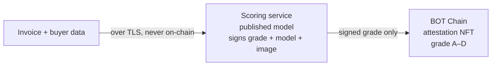
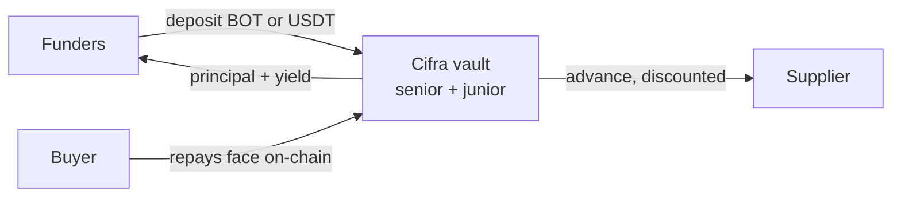

<p align="center">
  
  &nbsp;&nbsp;
  
</p>

<p align="center"><b>Private invoice factoring on BOT Chain — the buyer's credit is scored off-chain against a published model, and only a signed risk grade ever reaches the chain.</b></p>

<p align="center">RWA · BOT Chain mainnet 677 / testnet 968</p>

---

**Short product description:**
Cifra is **private invoice factoring, settled entirely on-chain**. A supplier factors a real
invoice for instant liquidity; the buyer's credit risk is scored **off-chain by a published,
deterministic model** — the buyer's identity and payment history never touch the chain. Funders
see only a **signed risk grade** and fund the invoice from a senior/junior vault. Settlement and
default are directly observable on-chain. Two independent books run in parallel: **native BOT**
and **USDT**.

**Target user:**
- **Suppliers** — SMEs holding unpaid invoices who need liquidity but won't expose their
  customer relationships to get scored.
- **Funders** — BOT and USDT holders seeking real-world-asset yield who need a risk grade they
  can act on without seeing the underlying data.
- **Buyers / debtors** — the paying counterparties, whose financials are the sensitive input
  that must stay private.

## The problem

The world's unmet demand for trade finance is **$2.5 trillion**, and SMEs are rejected at a
**41%** rate. But the deeper blocker isn't capital — it's that traditional invoice factoring
forces a supplier to hand a bank or middleman full transparency into their customer
relationships: **debtor names, payment histories, financials.** For most small businesses that's
a dealbreaker on its own, independent of price. The data required to make the credit decision is
exactly the data they can't afford to expose.

## Our solution

Cifra makes the credit decision on real financial data **without that data ever becoming
public.** A supplier factors an invoice for instant liquidity; the buyer's risk is scored by a
service running a published, integer-arithmetic model, which signs a categorical grade (A–D)
bound to that specific invoice. Funders see only the signed grade and fund from a senior/junior
vault. The buyer then repays on-chain, and the contract observes the payment itself.





> Funders earn the discount spread when the buyer settles. On default, the **junior** tranche
> absorbs the loss first — senior is protected.

---

## Trust model — stated plainly

This project was previously built on Flare, where scoring ran inside a hardware-attested TEE.
**On BOT Chain it does not**, and the README says so rather than quietly keeping the old
language. What is and isn't guaranteed:

| Claim | Guaranteed? |
|---|---|
| The grade came from the key registered on-chain | ✅ verified by `ecrecover` in `CifraAttestationNFT` |
| The grade is bound to exactly one invoice | ✅ the invoiceId is inside the signed payload |
| A grade cannot be replayed onto another chain | ✅ chainId is inside the signed payload |
| Raw buyer data never reaches the chain | ✅ only the grade is submitted |
| Settlement and default are honest | ✅ **directly observable on-chain** — no oracle involved |
| The published model produced the grade | ⚠️ **checkable, not proven** — see below |
| The operator cannot read buyer data | ❌ **no.** The service receives it over TLS. |

The scorer signs the **`modelVersion`** and the container **`imageDigest`** alongside the grade,
and both are recorded on-chain. Anyone can pull that exact image, re-run it on the same inputs,
and confirm the result — the model is a published weighted formula in integer arithmetic, so it
is bit-for-bit reproducible. What that cannot prove is that the running container *was* that
image; only hardware attestation can, and that gap is real.

`CifraAttestationNFT.setScorerAddress()` is deliberately owner-settable, so moving to an
attested signer later is a key rotation rather than a contract migration.

## What each piece does

| Component | Role |
|---|---|
| **`CifraInvoiceRegistry`** | Invoices as commitments. The buyer is an opaque hash; the face value, due date and status are public. Shared across both books. |
| **`CifraAttestationNFT`** | Verifies the scorer's signature, checks the invoice binding, and records the grade + model version + image digest as an ERC-721. Shared across both books. |
| **`CifraTrancheController`** | Holds one book's pooled asset and runs the funding + repayment/default waterfall. One per settlement asset. |
| **`CifraTrancheVault`** | ERC-4626 senior/junior share classes over the controller's pool. |
| **`CifraSettlement`** | The buyer repays on-chain; default is a `block.timestamp` check anyone can call. No oracle, no reserve. |
| **`CifraNativeDepositHelper`** | One-transaction native BOT → WBOT → tranche, and back. |
| **`CifraNavOracle`** | **Display only.** Prices a volatile book's NAV in USD via a BDEX V3 TWAP. Nothing economic reads it. |
| **`CifraFunderRegistry`** | Allowlist of addresses permitted to hold tranche shares. Gates deposits and transfers; **never gates exit**. Ships open, enforced by a governance switch. |
| **`scorer/`** | The Go scoring service. Stateless, no database, runs on Cloud Run. |

## Two books, and why they never mix

An invoice is faced, funded and repaid in **the same token**. `CifraTrancheController` holds one
immutable `IERC20` and converts nothing, so Cifra runs the whole stack once per settlement
asset.

That is not an implementation detail — it is what keeps FX risk out of the loan book. A $10,000
invoice funded in BOT and repaid 60 days later would be a different debt if BOT moved, and
converting at settlement would put a manipulable DEX price on the critical path at the exact
moment money moves. Per-book isolation removes the problem instead of pricing it: a funder who
deposits BOT has chosen BOT exposure, which is their position, not a protocol defect.

The consequence worth noticing: **no price oracle is consulted on any path where money moves.**

## Scoring model — transparent by design (only the *inputs* are private)

```
risk = 0.4·repayment_history + 0.3·relationship_size + 0.2·tenor + 0.1·jurisdiction
grade = A (≥80) | B (≥60) | C (≥40) | D (<40)
discount_rate = base_rate + grade_spread[grade]
```

Published, auditable, and computed entirely in integer basis points — no floating point
anywhere, so the result is exactly reproducible on any machine. That determinism is what makes
the signed grade checkable, and it is a deliberate choice: a model with hidden state would score
no better here and could not be verified at all.

Source: [`scorer/pkg/scoring/scoring.go`](scorer/pkg/scoring/scoring.go).

## Provenance of the private inputs

Optionally, the data source signs a commitment to the buyer's history
(`keccak256(canonical(inputs) ‖ salt)`), and the scorer refuses to grade inputs that don't hash
to a commitment a trusted source signed. So a funder can confirm the grade was computed on data
the source vouched for, **without the data being disclosed to them or put on-chain**. The salt
stays private because the inputs are low-entropy enough to brute-force otherwise.

This replaces Flare's FDC Web2Json anchor. The trust model changed honestly: rather than an
attestation network vouching for an HTTP response, the source signs its own data — which for a
specific customer's private payment history is arguably the only party that *can* authenticate
it. zkTLS / web proofs are the trust-minimizing upgrade.

---

## Live on BOT Chain testnet (chain 968)

All contracts source-verified on [`scan.bohr.life`](https://scan.bohr.life).
`deployments/cifra-botchainTestnet.json` is the source of truth; this table can drift.

| Contract | Address |
|---|---|
| CifraInvoiceRegistry (shared) | [`0xD0aBd1Dc…`](https://scan.bohr.life/address/0xD0aBd1Dc433571b7F0bA243f0b56b3dE3610fd37) |
| CifraAttestationNFT (shared) | [`0x16D6d433…`](https://scan.bohr.life/address/0x16D6d4335A01f75c252f86607a076700427Fea00) |
| **BOT book** — controller | [`0x402FF5AA…`](https://scan.bohr.life/address/0x402FF5AA2735Dca465D9784AD7f3A43CCfa7deC2) |
| BOT senior (cBOT-S) / junior (cBOT-J) | [`0xCa3b3D11…`](https://scan.bohr.life/address/0xCa3b3D111725E1b006FFB8924a88eBB171d6CCfD) / [`0x7BEBCFC4…`](https://scan.bohr.life/address/0x7BEBCFC47be110a0175452456267bFdaD45DdE8B) |
| BOT settlement | [`0xD2947813…`](https://scan.bohr.life/address/0xD294781367B339D1E6950b4C0B02a67425D7247E) |
| CifraNativeDepositHelper | [`0xF49941FA…`](https://scan.bohr.life/address/0xF49941FAe789D724e82102704DA0C359e96026ee) |
| **USDT book** — controller | [`0xDAf65f32…`](https://scan.bohr.life/address/0xDAf65f322A2f750684283f91BC732479989b29fC) |
| USDT senior (cUSDT-S) / junior (cUSDT-J) | [`0x944D4853…`](https://scan.bohr.life/address/0x944D4853eC49aDeda031655EBC837a3B0CbeFe56) / [`0x66f16F3C…`](https://scan.bohr.life/address/0x66f16F3CAd4f4b6cCace243FA5E075B97A7D7A75) |
| USDT settlement | [`0x0C01c24B…`](https://scan.bohr.life/address/0x0C01c24B3E698FD5d8504A26b5517A1f02Da94f6) |

External, per network (never shared across chains — the mainnet USDT address is a *different
token* on testnet): see [`config/networks.ts`](config/networks.ts).

### The whole lifecycle, run live

`scripts/e2eLifecycle.ts` runs both paths against the deployed book, taking its grades from the
real scoring service over HTTP:

```
register → score → attest → fund → PAY       NAV 1.2 → 1.24, yield split 50/50
register → score → attest → fund → DEFAULT   junior 0.62 → 0.15, senior untouched
```

The attest step is the cross-language check: a signature produced by Go has to be accepted by
Solidity's `ecrecover`, or nothing downstream happens.

---

## Run it

```bash
npm install
npx hardhat test                 # 101 unit tests
cd scorer && go test ./...       # scoring model + signature scheme
```

Deploy both books to testnet:

```bash
cp .env.example .env             # set PRIVATE_KEY; fund at faucet.botchain.ai/basic
npx hardhat run scripts/deployCifra.ts   --network botchainTestnet
npx hardhat run scripts/checkDeploy.ts   --network botchainTestnet   # 47 on-chain assertions
```

Full setup — the frontend, the scoring service, Cloud Run — is in **[SETUP.md](SETUP.md)**.

---

## Honest disclosures

- **No hardware attestation.** Scoring runs on Cloud Run, not in a TEE. See *Trust model* above.
  The signed `imageDigest` makes grades reproducible, not attested.
- **The operator can read buyer data.** ECIES payload encryption is supported and keeps data out
  of proxy logs, but it is defence in depth, not confidentiality against Cifra.
- **Invoices in the demo are synthetic.** The tranching, settlement and default machinery is
  live and unmocked; the receivables are not yet real. Onboarding a genuine receivable is the
  next milestone, and the single most valuable thing this project can do.
- **The live default demo uses a `GRACE_PERIOD = 0` settlement**, because production grace is 3
  days and a live chain cannot time-travel. Identical logic, different constant; the script
  restores the real settlement afterwards.
- **Testnet only so far.** Mainnet (677) deployment is pending.
- **No compliance layer operating yet** — no KYC/KYB provider, no assignment-of-receivable
  instrument, no legal entity. The *mechanism* to restrict funders exists
  (`CifraFunderRegistry`) but **ships open**, so deposits are permissionless until governance
  switches it on. Senior and junior tranches sold to passive funders would, at production scale,
  plausibly be securities. Full picture in
  **[docs/REGULATORY_POSTURE.md](docs/REGULATORY_POSTURE.md)**.
- **Contracts are unaudited** beyond internal review, and the governance Safe has no timelock.

## Roadmap

- **Mainnet deployment** on BOT Chain 677 — the launch sequence is written down in
  `claude-docs/MAINNET_RUNBOOK.md`.
- **A real receivable** with a named counterparty, behind the debtor-approval flow.
- **Debtor approval onramp** — the buyer acknowledges the invoice by email + OTP, which is the
  notice-of-assignment artifact real factoring turns on.
- **Attested scoring** — a GCE Confidential Space signer, reachable via `setScorerAddress`
  without a contract migration.
- **zkTLS provenance** for the private inputs, replacing source-signed commitments.
- **Regulatory posture** — permissioned funder participation, KYC/KYB placement, and the legal
  mechanics of assignment.

## License

[MIT](LICENSE) © 2026 Cifra
