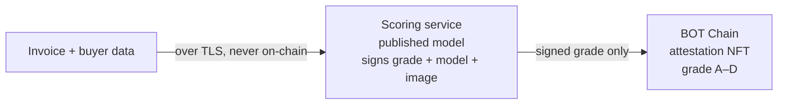
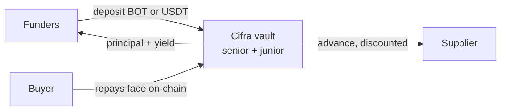

<p align="center">
  
  &nbsp;&nbsp;
  
</p>

<p align="center"><b>Private invoice factoring on BOT Chain — the buyer's credit is scored off-chain against a published model, and only a signed risk grade ever reaches the chain.</b></p>

<p align="center">RWA · BOT Chain mainnet 677 / testnet 968</p>

---

**Short product description:**
Cifra is **private invoice factoring, settled entirely on-chain**. A supplier factors a real
invoice for instant liquidity; the buyer's credit risk is scored **off-chain by a published,
deterministic model** — the buyer's identity and payment history never touch the chain. Funders
see only a **signed risk grade** and fund the invoice from a senior/junior vault. Settlement and
default are directly observable on-chain. Two independent books run in parallel: **native BOT**
and **USDT**.

**Target user:**
- **Suppliers** — SMEs holding unpaid invoices who need liquidity but won't expose their
  customer relationships to get scored.
- **Funders** — BOT and USDT holders seeking real-world-asset yield who need a risk grade they
  can act on without seeing the underlying data.
- **Buyers / debtors** — the paying counterparties, whose financials are the sensitive input
  that must stay private.

## The problem

The world's unmet demand for trade finance is **$2.5 trillion**, and SMEs are rejected at a
**41%** rate. But the deeper blocker isn't capital — it's that traditional invoice factoring
forces a supplier to hand a bank or middleman full transparency into their customer
relationships: **debtor names, payment histories, financials.** For most small businesses that's
a dealbreaker on its own, independent of price. The data required to make the credit decision is
exactly the data they can't afford to expose.

## Our solution

Cifra makes the credit decision on real financial data **without that data ever becoming
public.** A supplier factors an invoice for instant liquidity; the buyer's risk is scored by a
service running a published, integer-arithmetic model, which signs a categorical grade (A–D)
bound to that specific invoice. Funders see only the signed grade and fund from a senior/junior
vault. The buyer then repays on-chain, and the contract observes the payment itself.





> Funders earn the discount spread when the buyer settles. On default, the **junior** tranche
> absorbs the loss first — senior is protected.

---

## What each piece does

| Component | Role |
|---|---|
| **`CifraInvoiceRegistry`** | Invoices as commitments. The buyer is an opaque hash; the face value, due date and status are public. Shared across both books. |
| **`CifraAttestationNFT`** | Verifies the scorer's signature, checks the invoice binding, and records the grade + model version + image digest as an ERC-721. Shared across both books. |
| **`CifraTrancheController`** | Holds one book's pooled asset and runs the funding + repayment/default waterfall. One per settlement asset. |
| **`CifraTrancheVault`** | ERC-4626 senior/junior share classes over the controller's pool. |
| **`CifraSettlement`** | The buyer repays on-chain; default is a `block.timestamp` check anyone can call. No oracle, no reserve. |
| **`CifraNativeDepositHelper`** | One-transaction native BOT → WBOT → tranche, and back. |
| **`CifraNavOracle`** | **Display only.** Prices a volatile book's NAV in USD via a BDEX V3 TWAP. Nothing economic reads it. |
| **`CifraFunderRegistry`** | Allowlist of addresses permitted to hold tranche shares. Gates deposits and transfers; **never gates exit**. Ships open, enforced by a governance switch. |
| **`scorer/`** | The Go scoring service. Stateless, no database, runs on Cloud Run. |

## Two books, and why they never mix

An invoice is faced, funded and repaid in **the same token**. `CifraTrancheController` holds one
immutable `IERC20` and converts nothing, so Cifra runs the whole stack once per settlement
asset.

That is not an implementation detail — it is what keeps FX risk out of the loan book. A $10,000
invoice funded in BOT and repaid 60 days later would be a different debt if BOT moved, and
converting at settlement would put a manipulable DEX price on the critical path at the exact
moment money moves. Per-book isolation removes the problem instead of pricing it: a funder who
deposits BOT has chosen BOT exposure, which is their position, not a protocol defect.

The consequence worth noticing: **no price oracle is consulted on any path where money moves.**

## Scoring model — transparent by design (only the *inputs* are private)

```
risk = 0.4·repayment_history + 0.3·relationship_size + 0.2·tenor + 0.1·jurisdiction
grade = A (≥80) | B (≥60) | C (≥40) | D (<40)
discount_rate = base_rate + grade_spread[grade]
```

Published, auditable, and computed entirely in integer basis points — no floating point
anywhere, so the result is exactly reproducible on any machine. That determinism is what makes
the signed grade checkable, and it is a deliberate choice: a model with hidden state would score
no better here and could not be verified at all.

Source: [`scorer/pkg/scoring/scoring.go`](scorer/pkg/scoring/scoring.go).

## Provenance of the private inputs

Optionally, the data source signs a commitment to the buyer's history
(`keccak256(canonical(inputs) ‖ salt)`), and the scorer refuses to grade inputs that don't hash
to a commitment a trusted source signed. So a funder can confirm the grade was computed on data
the source vouched for, **without the data being disclosed to them or put on-chain**. The salt
stays private because the inputs are low-entropy enough to brute-force otherwise.

This replaces Flare's FDC Web2Json anchor. The trust model changed honestly: rather than an
attestation network vouching for an HTTP response, the source signs its own data — which for a
specific customer's private payment history is arguably the only party that *can* authenticate
it. zkTLS / web proofs are the trust-minimizing upgrade.

---

## Live on BOT Chain mainnet (chain 677)

Deployed 2026-08-22. All contracts source-verified on
[`scan.botchain.ai`](https://scan.botchain.ai). `deployments/cifra-botchain.json` is the source
of truth; this table can drift.

📄 **[docs/DEPLOYMENT_MAINNET.md](docs/DEPLOYMENT_MAINNET.md)** — every deployed address with its
creation transaction hash and explorer link, in plain text.

| Contract | Address |
|---|---|
| CifraInvoiceRegistry (shared) | [`0x55829829…`](https://scan.botchain.ai/address/0x558298297E714312D5670dBe4dbc15E1D240a811) |
| CifraFunderRegistry (shared) | [`0x96A49787…`](https://scan.botchain.ai/address/0x96A4978752D0fC8FccDe3c168A6a9E1c20B62330) |
| CifraAttestationNFT (shared) | [`0x7Bbfb48B…`](https://scan.botchain.ai/address/0x7Bbfb48BCEDF4B562fAB3cFdcb5974bf7cACd290) |
| **BOT book** — controller | [`0x8302523b…`](https://scan.botchain.ai/address/0x8302523b9AbE6508388E669Cc6E452961747d90E) |
| BOT senior (cBOT-S) / junior (cBOT-J) | [`0x9822650A…`](https://scan.botchain.ai/address/0x9822650A99bD33F29E383345F570dAE1e4E00928) / [`0xb27f6D44…`](https://scan.botchain.ai/address/0xb27f6D44036C38fE415906209aC1C5cfbd71adF9) |
| BOT settlement | [`0x8AC436e5…`](https://scan.botchain.ai/address/0x8AC436e5BB681aE4d576e0131391aE3AACA88BDe) |
| CifraNavOracle (display-only) | [`0xFcCF0117…`](https://scan.botchain.ai/address/0xFcCF01179c3e6AB33796a9D2804380D1C609b3bA) |
| CifraNativeDepositHelper | [`0x53e11f0B…`](https://scan.botchain.ai/address/0x53e11f0BF461f87A8783c45B1880a5C6C1AEfC34) |
| **USDT book** — controller | [`0x4ffa0A4F…`](https://scan.botchain.ai/address/0x4ffa0A4FBF242133C125fdF574e0FF3521173Cad) |
| USDT senior (cUSDT-S) / junior (cUSDT-J) | [`0x00390B41…`](https://scan.botchain.ai/address/0x00390B4190E2F5D95a677FD7D300Ae03b876ca1C) / [`0x325998F4…`](https://scan.botchain.ai/address/0x325998F428BEb420C2931e33f5a5D0C669fdA82B) |
| USDT settlement | [`0xD5F5f7Db…`](https://scan.botchain.ai/address/0xD5F5f7DbcD8a51CBfF513749bC0Cc55fd5f10Bf2) |
| **Governance Safe (2-of-3)** | [`0x73DFfa09…`](https://scan.botchain.ai/address/0x73DFfa09B08458F924bc26fd786fC6FDf481B4b8) |

`GRACE_PERIOD` is **14 days** and immutable. `scripts/verifyGov.ts` reports all governance
checks passed against this set. What that check does and does not cover — and the state of the
funder allowlist — is in [docs/HONEST_DISCLOSURES.md](docs/HONEST_DISCLOSURES.md).

An earlier deployment on BOT Chain testnet (chain 968) remains live at
`deployments/cifra-botchainTestnet.json`, with its own scoring service on chainId 968.

External, per network (never shared across chains — the mainnet USDT address is a *different
token* on testnet): see [`config/networks.ts`](config/networks.ts).

### The whole lifecycle, run live

`scripts/e2eLifecycle.ts` runs both paths against the deployed book, taking its grades from the
real scoring service over HTTP:

Both paths were run on **mainnet** on 2026-08-22, on both books:

```
BOT book   register → score(B) → attest → fund → PAY       NAV 0.04 → 0.0416, yield split 50/50
           register → score(A) → attest → fund → DEFAULT   junior 0.0208 → 0.002, senior untouched
USDT book  register → score(B) → attest → fund → PAY       NAV 1.0  → 1.04,   yield split 50/50
           register → score(A) → attest → fund → DEFAULT   junior 0.52 → 0.05, senior untouched
```

The attest step is the cross-language check: a signature produced by Go has to be accepted by
Solidity's `ecrecover`, or nothing downstream happens.

---

## Run it

```bash
npm install
npx hardhat test                 # 101 unit tests
cd scorer && go test ./...       # scoring model + signature scheme
```

Deploy both books to testnet:

```bash
cp .env.example .env             # set PRIVATE_KEY; fund at faucet.botchain.ai/basic
npx hardhat run scripts/deployCifra.ts   --network botchainTestnet
npx hardhat run scripts/checkDeploy.ts   --network botchainTestnet   # 47 on-chain assertions
```

Full setup — the frontend, the scoring service, Cloud Run — is in **[SETUP.md](SETUP.md)**.

---

## Honest disclosures

Everything true about Cifra that the demo does not show you — the trust model, what governance
can and cannot do today, what is synthetic, and what is not audited — is documented in full:

**→ [docs/HONEST_DISCLOSURES.md](docs/HONEST_DISCLOSURES.md)**

It is a single page, nothing in it is softened, and it is linked here rather than summarised so
there is one copy to keep current. The regulatory picture is its companion:
[docs/REGULATORY_POSTURE.md](docs/REGULATORY_POSTURE.md).

## Roadmap

- **A real receivable** with a named counterparty, behind the debtor-approval flow.
- **Debtor approval onramp** — the buyer acknowledges the invoice by email + OTP, which is the
  notice-of-assignment artifact real factoring turns on.
- **Attested scoring** — a GCE Confidential Space signer, reachable via `setScorerAddress`
  without a contract migration.
- **zkTLS provenance** for the private inputs, replacing source-signed commitments.
- **Regulatory posture** — permissioned funder participation, KYC/KYB placement, and the legal
  mechanics of assignment.

## License

[MIT](LICENSE) © 2026 Cifra
