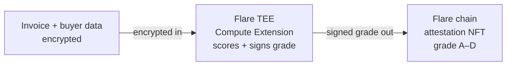
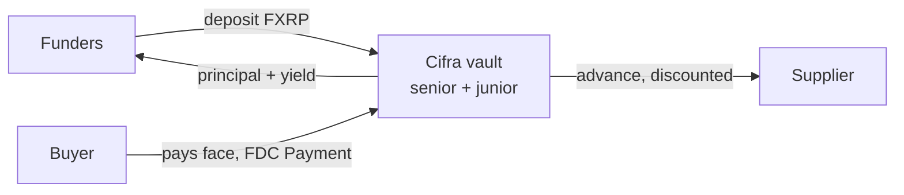

<p align="center">
  
  &nbsp;&nbsp;
  
</p>

<p align="center"><b>Private invoice factoring on Flare — the buyer's credit is scored privately inside a TEE, and only a signed risk grade ever reaches the chain.</b></p>

<p align="center">Bounty 2 — Confidential Compute Apps · Coston2 (chain 114)</p>

---
**Short product description:**
Cifra is **private invoice factoring, TEE-scored and settled entirely on Flare**. A supplier factors a real invoice for instant FXRP liquidity; the buyer's credit risk is scored **privately inside a Flare Compute Extension (TEE)** — the buyer's identity and payment history never leave the enclave. Funders see only a **TEE-signed risk grade** and fund the invoice from a senior/junior FXRP vault. Settlement and default are proven with FDC attestations. Onboarding is XRPL-native via Smart Accounts (no EVM wallet).

**Target user:**
- **Suppliers** — SMEs holding unpaid invoices who need liquidity but won't expose their customer relationships to get scored.
- **Funders** — FXRP holders seeking real-world-asset yield who need to trust a risk grade without seeing the underlying data.
- **Buyers / debtors** — the paying counterparties, whose financials are the sensitive input that must stay private.

## The problem

The world's unmet demand for trade finance is **$2.5 trillion**, and SMEs are rejected at a **41%** rate. But the deeper blocker isn't capital — it's that traditional invoice factoring forces a supplier to hand a bank or middleman full transparency into their customer relationships: **debtor names, payment histories, financials.** For most small businesses that's a dealbreaker on its own, independent of price. The data required to make the credit decision is exactly the data they can't afford to expose.

## Our solution

Cifra makes the credit decision on **real** financial data **without that data — or even whose data it is — ever becoming visible to anyone.** A supplier factors an invoice for instant FXRP liquidity; the buyer's risk is scored **privately inside a Flare Compute Extension (TEE)**, which signs a categorical grade (A–D) with its attested key. Funders see only that signed grade and fund the invoice from a senior/junior FXRP vault. Settlement and default are proven with FDC attestations, and onboarding is XRPL-native via Smart Accounts — no EVM wallet. **The entire loop stays on Flare's own rails**, and the buyer's raw data never leaves the enclave.

### The private scoring flow



> The buyer's identity and financials never leave the enclave — only the signed grade does.

### The capital cycle



> Funders earn the discount spread when the buyer settles. On default (FDC `ReferencedPaymentNonexistence`), the **junior** tranche absorbs the loss first — senior is protected.

---

## Why Confidential Compute — Bounty 2

Bounty 2 asks for applications where privacy or secure execution creates a better product, and for a clear account of *what runs privately, what is verified on-chain, what trust assumptions exist, and why a TEE beats a plain contract.* Cifra answers all four head-on:

- **What runs privately inside the TEE** — the debtor's raw payment-history and financial data, the debtor's identity, and the scoring computation itself.
- **What is verified / consumed on-chain** — only a **TEE-signed grade (A–D) + discount rate**, an invoice commitment binding the exact invoice, and a Web2Json **provenance commitment** vouching the data's source. Each grade is verified against the registered TEE machine identity. No raw data, no debtor identity, ever touches the chain.
- **Trust assumptions, stated plainly** — the security of the TEE hardware (side-channel risk is real, not glossed); the Flare data-provider consensus that relays an instruction to the enclave; and the fact that a TEE proves the code **ran** as deployed, not that the model is a **good** one — "verifiably honest" and "verifiably accurate" are different claims. On Coston2 the enclave runs in Flare's sanctioned `SIMULATED_TEE` mode (real execution, real signing, on-chain-verified); production uses a real Confidential Space TEE.
- **Why a TEE and not a contract or ZK** — the scoring logic ingests unstructured, real-world financial data and runs heuristic weighting on it: natural and cheap inside a TEE, impractical to express as a verifiable arithmetic circuit, and impossible to do transparently on-chain without destroying the entire point of the product.

**And it isn't a slideshow — the whole loop is proven live on Coston2.** A real TEE-signed grade verified on-chain, real FXRP minted from XRP, XRPL-native onboarding, senior/junior tranches, and FDC-proven settlement **and** default. Where a prior confidential-compute invoice project split its stack onto a second chain, **Cifra is the only design that keeps scoring, funding, and settlement Flare-native end-to-end** — so the TEE-signed grade the whole product hinges on never has to leave the chain it settles on.

---

## Live on Coston2 — nothing is mocked

Every row below is a real on-chain action you can open in the explorer.

| Step | What actually happens | Flare primitive | Proof (Coston2) |
|---|---|---|---|
| **Mint** | 10 real XRP → FAssets Core Vault → **9.9 FXRP minted** | FAssets direct minting + FDC `XRPPayment` | [`0xd8bb461e…`](https://coston2-explorer.flare.network/tx/0xd8bb461e3d3078c4f74af4fbae120cdfab9e2fbc7edf5535450fd26e29ddb4f9) |
| **Register** | an **XRPL-native supplier, no EVM wallet**, registers an invoice with one XRPL payment; owned by their deterministic PersonalAccount; buyer is an opaque commitment hash | Smart Accounts custom instruction (`0xFE`) + FDC `XRPPayment` | [`0x4f76002e…`](https://coston2-explorer.flare.network/tx/0x4f76002e3e837cd258c9c062122d24a7e0118fdeed8df4dadca300f67c36111a) |
| **Score + attest** | encrypted buyer data scored **inside the enclave**; the grade is TEE-signed **bound to the invoiceId**; `attest` verifies the signature and the binding on-chain before minting the grade NFT | FCC / TEE extension | grade NFT on-chain (signer = registered PRODUCTION machine) |
| **Fund** | vault advances `face × (1 − TEE discount)` FXRP to the supplier | FXRP senior/junior vault | on-chain |
| **Settle — 50/50 split** | real XRPL payment → real FDC `Payment` → verified vs live FdcVerification; NAV 10.0→10.3, senior +0.15 / junior +0.15 | FDC `Payment` | [`0xf1fea3ff…`](https://coston2-explorer.flare.network/tx/0xf1fea3ff0e3ec53c340d5e60e17b0a673522968b8ab35e6ca6f57491a3523610) |
| **Default — junior first-loss** | real FDC `ReferencedPaymentNonexistence` → `markDefault`; NAV 10.3→5.6, **junior 4.15→0 (wiped first), senior only −0.55** | FDC `RPN` | [`0x2a8051f6…`](https://coston2-explorer.flare.network/tx/0x2a8051f6eb5fb90838dcab34ce21935c05c42a2d840bb110b1d8fb6853a45c62) |

**The TEE round-trip is real.** A registered **PRODUCTION** machine on Coston2 decrypts the buyer's payment history in-enclave, runs Cifra's scoring model, and signs the grade — bound to the specific invoiceId — with its attested identity key. `CifraAttestationNFT` verifies that signature (`ecrecover` against the registered TEE identity, matching the tee-node's `TEE_ACTION_RESULT` signing scheme) **and** the invoiceId binding before recording the grade. So a grade computed for one invoice cannot be replayed onto another.

### Contracts (all verified on the explorer)

| Contract | Address |
|---|---|
| CifraInvoiceRegistry | [`0xa74Ac3023c0cB1D61b120353961ab9cf992C1cb8`](https://coston2-explorer.flare.network/address/0xa74Ac3023c0cB1D61b120353961ab9cf992C1cb8#code) |
| CifraAttestationNFT | [`0xFC021Cf0B582bc408da1bB85a4b033C0f41bc064`](https://coston2-explorer.flare.network/address/0xFC021Cf0B582bc408da1bB85a4b033C0f41bc064#code) |
| CifraTrancheController (FXRP pool + funding/waterfall) | [`0xC06e9546313c17dCf1a183789024159b4a7Dae18`](https://coston2-explorer.flare.network/address/0xC06e9546313c17dCf1a183789024159b4a7Dae18#code) |
| CifraTrancheVault — Senior (ERC-4626, protected) | [`0x0AdED451731753a440A72D74DEa6CBb4fd30c3Cb`](https://coston2-explorer.flare.network/address/0x0AdED451731753a440A72D74DEa6CBb4fd30c3Cb#code) |
| CifraTrancheVault — Junior (ERC-4626, first-loss) | [`0x33B9BC6Dc4ff1C6bC0C2fC700E183592BcA89832`](https://coston2-explorer.flare.network/address/0x33B9BC6Dc4ff1C6bC0C2fC700E183592BcA89832#code) |
| CifraSettlement (live FdcVerification, explicit reserve) | [`0x55BaD904B39A1A1f276085B24547277088a6856B`](https://coston2-explorer.flare.network/address/0x55BaD904B39A1A1f276085B24547277088a6856B#code) |
| CifraNavOracle — Senior / Junior (USD NAV via FTSO) | [`0xf0dc254B…`](https://coston2-explorer.flare.network/address/0xf0dc254BF37E4876DEceA3a529356d7C0f14B207#code) / [`0xE558F283…`](https://coston2-explorer.flare.network/address/0xE558F2834862f15d5fA4c2418A3dA79c428180B2#code) |
| CifraJurisdictionOracle (jurisdiction risk via FDC Web2Json) | [`0x5BEA2143d4D515b12bacE4dc3f70B364240D029C`](https://coston2-explorer.flare.network/address/0x5BEA2143d4D515b12bacE4dc3f70B364240D029C#code) |
| **Governance Safe (2-of-3)** | [`0x5D0549293b3B2C0434B7580414d5b8b7bFC83224`](https://coston2-explorer.flare.network/address/0x5D0549293b3B2C0434B7580414d5b8b7bFC83224) |

Real externals (resolved on-chain via the FlareContractRegistry, not hardcoded): **FXRP** `0x0b6A3645…`, **FdcVerification** `0x906507E0…`, **AssetManagerFXRP** `0xc1Ca88b9…`, **MasterAccountController** `0x434936d4…`, **FtsoV2** via `getContractAddressByName("FtsoV2")`.

---

## Flare primitives — each does load-bearing work

| Primitive | Role in Cifra |
|---|---|
| **FCC / TEE extension** | The product. Scores private buyer data in-enclave and signs the grade; only the grade leaves. |
| **FXRP / FAssets** | Settlement asset end-to-end — real direct-mint from XRP, funders deposit it, suppliers receive it (redeemable to native XRP). |
| **FDC** | `Payment` attests settlement; `XRPPayment` attests the mint + onboarding payments; `ReferencedPaymentNonexistence` certifies default; **`Web2Json`** sources verifiable jurisdiction data *and* anchors a payment-history provenance commitment. |
| **Smart Accounts** | XRPL-native onboarding — register an invoice from an XRPL payment alone (no FLR, no EVM wallet) via a `0xFE` custom instruction on the supplier's deterministic PersonalAccount. |
| **FTSO** | USD valuation — `CifraNavOracle` reads the XRP/USD block-latency feed to price the FXRP vault NAV and per-share value for funders. |

## Scoring model — transparent by design (only the *inputs* are private)

A published, integer-math weighted formula runs inside the enclave:

```
risk = 0.4·repayment_history + 0.3·relationship_size + 0.2·tenor + 0.1·jurisdiction
grade = A (≥80) | B (≥60) | C (≥40) | D (<40)
discount_rate = base_rate + grade_spread[grade]
```

The logic is auditable; the buyer's raw data never leaves the TEE. Integer/basis-point arithmetic keeps the result exactly reproducible (which matters for the TEE's attested code hash). In v2 the jurisdiction term is sourced live from the on-chain `Web2Json` oracle, and the private inputs carry a Web2Json-attested provenance commitment the enclave verifies before signing.

---

## Run it

The web app reads live Coston2 data and needs **no keys or config**:

```bash
cd frontend
npm install
npm run dev        # → http://localhost:3000
```

Full setup — contracts, tests, the TEE extension, and the live end-to-end scripts — is in **[SETUP.md](SETUP.md)**.

---

## Honest disclosures

Nothing in the loop above is mocked. The deliberate, disclosed simplifications:

- **`SIMULATED_TEE=true` on Coston2** — Flare's sanctioned testnet path: the enclave really executes the scoring code, really signs, and the signature is really verified on-chain via the Coston2 data-provider consensus. The *hardware attestation* is simulated; production sets `SIMULATED_TEE=false` on a real Confidential Space TEE.
- **Buyer payment-history values are synthetic (v1).** The **v2 provenance mechanism is built and proven live** — the enclave refuses to sign unless the private inputs hash to a commitment that is itself attested on-chain via FDC `Web2Json`, and it consumes the on-chain Web2Json jurisdiction value. But the source accounting API is a **disclosed mock** (an echo endpoint returning the pre-computed commitment) — no public API returns a specific buyer's private history, so the provenance *mechanism* is the contribution, not the mock.
- Minor demo shortcuts (each with a real, disclosed rationale): the settlement reserve is pre-funded (replenished on-chain by direct-minting received XRP), a `GRACE=0` demo settlement for the live default, and a fixed (not tenor-scaled) discount.

---

## Roadmap

- **v3** — a published, governance-set, versioned scoring-model spec (the logic is already public; the inputs stay private).
- **Real accounting-API integration** for the private inputs behind the same Web2Json provenance commitment, plus a "bring-your-own-encryption-key" premium tier.
- **Production ops** — a real GCP Confidential Space TEE, persisted enclave identity, and timelock governance.
- **Protocol depth** — a time-accrued senior coupon, a bounty-incentivized Collector role for recovery on default, and a `0x02` redeem-to-XRP flourish for the supplier's advance.

---

## License

[MIT](LICENSE) © 2026 Cifra
